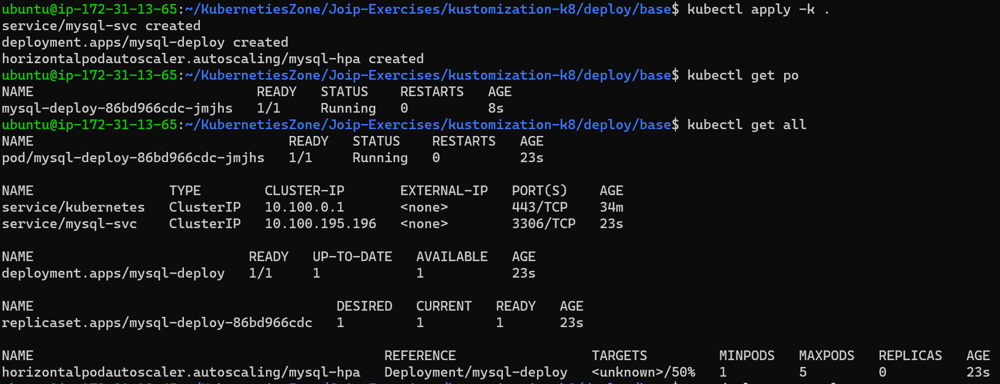
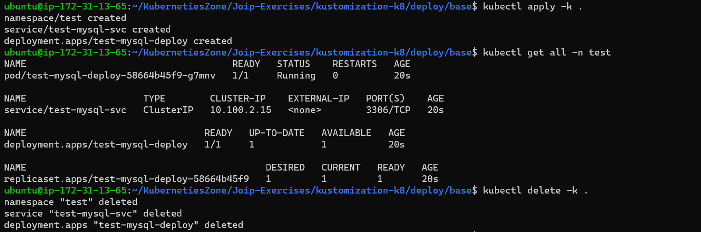
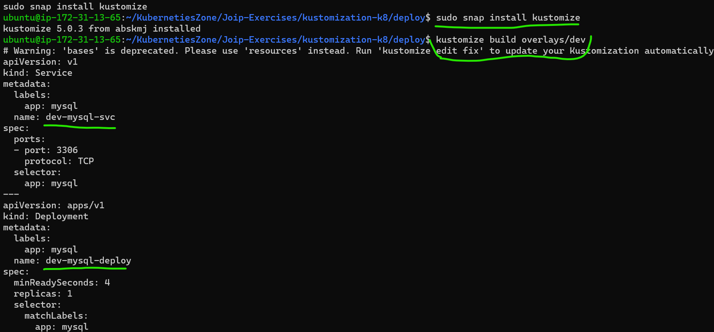
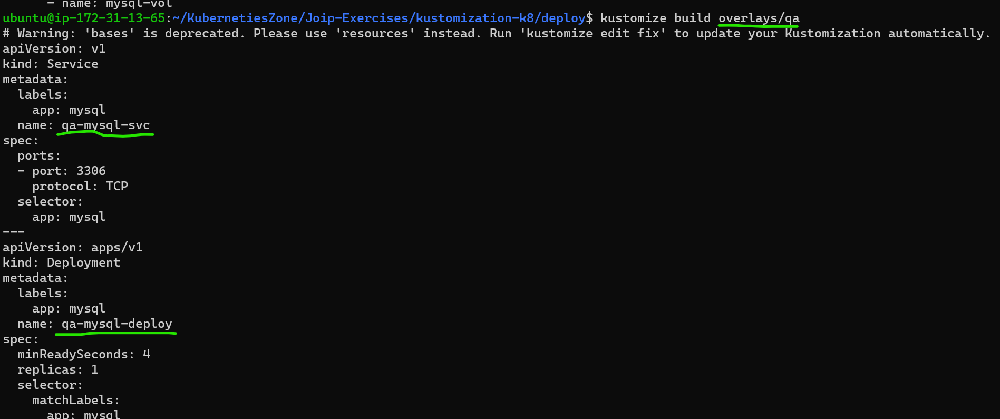
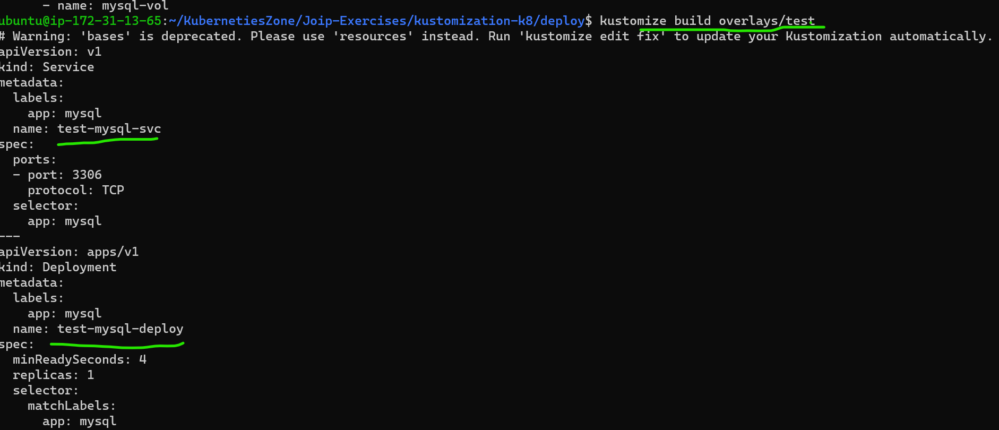
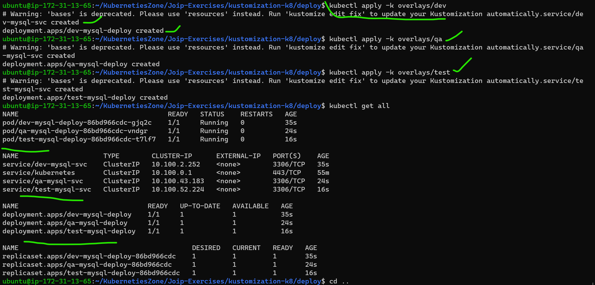

# Create Kubectl and working on Kustomization
## Installing EKS cluster

#### Prerequiretes
  * Take one EC2 instance with all ports
  * Install AWS-cli 
  * IAM user ( Accesskey , SecreatKey )
  * kebectl
  * AWS configure
  * eksctl
  * cluster.yaml file
  * ssh-keygen
  * ` eksctl create cluster -f cluster.yaml` command to create clusters
  * `kubectl get nodes`


## Install AWS-cli

[ReferHere](https://docs.aws.amazon.com/cli/latest/userguide/getting-started-install.html)
```bash
sudo apt update
sudo apt install unzip -y
curl "https://awscli.amazonaws.com/awscli-exe-linux-x86_64.zip" -o "awscliv2.zip"
unzip awscliv2.zip
sudo ./aws/install
```
## IAM user ( Accesskey , SecreatKey )
* Create one IAM user in our aws console management and get `Accesskey`, `Secreatkey` credentials.


## kebectl Installation

[ReferHere](https://kubernetes.io/docs/tasks/tools/install-kubectl-linux/) official docs
```bash
curl -LO "https://dl.k8s.io/release/$(curl -L -s https://dl.k8s.io/release/stable.txt)/bin/linux/amd64/kubectl"
sudo install -o root -g root -m 0755 kubectl /usr/local/bin/kubectl
kubectl version --client
```

## AWS configure

* In linux Terminal type these command `aws configure` and give Accesskey and Secreatkey

## eksctl Installation

[ReferHere](https://github.com/weaveworks/eksctl/blob/main/README.md#installation) offical docs
```bash
# for ARM systems, set ARCH to: `arm64`, `armv6` or `armv7`
ARCH=amd64
PLATFORM=$(uname -s)_$ARCH

curl -sLO "https://github.com/weaveworks/eksctl/releases/latest/download/eksctl_$PLATFORM.tar.gz"

# (Optional) Verify checksum
curl -sL "https://github.com/weaveworks/eksctl/releases/latest/download/eksctl_checksums.txt" | grep $PLATFORM | sha256sum --check

tar -xzf eksctl_$PLATFORM.tar.gz -C /tmp && rm eksctl_$PLATFORM.tar.gz

sudo mv /tmp/eksctl /usr/local/bin
```


## cluster.yaml file For creating two clusters

```yaml
apiVersion: eksctl.io/v1alpha5
kind: ClusterConfig

metadata:
  name: basic-cluster
  region: ap-south-1

nodeGroups:
  - name: basic-eksctl
    instanceType: t2.large
    desiredCapacity: 2
    volumeSize: 20
    ssh:
      allow: true # will use ~/.ssh/id_rsa.pub as the default ssh key
```
* above content is used in `vi cluster.yaml`

## ssh-keygen

 * In limnx-terminal we use these command `ssh-keygen`

## Install cluster these commands

* `eksctl create cluster -f cluster.yaml` command to create clusters
* `kubectl get nodes`

* kubectl is ready

### Install kustomize follow these steps

[ReferHere](https://www.vultr.com/docs/how-to-configure-kubernetes-resources-with-kustomize/)

```bash
wget https://raw.githubusercontent.com/kubernetes-sigs/kustomize/master/hack/install_kustomize.sh
bash install_kustomize.sh
mv kustomize /usr/local/bin
```

`git clone https://github.com/laxmanclassnotes/KubernetiesZone.git` type these command for my deployment files are in these url

* vi `deployment.yaml`

```yaml
---
apiVersion: apps/v1
kind: Deployment
metadata:
  name: mysql-deploy
  labels:
    app: mysql
spec:
  minReadySeconds: 4
  replicas: 1
  selector:
    matchLabels:
      app: mysql
  strategy:
    type: RollingUpdate
    rollingUpdate:
      maxSurge: 25%
      maxUnavailable: 25%
  template:
    metadata:
      name: mysql
      labels:
        app: mysql
    spec:
      containers:
        - name: mysql
          image: mysql:5.6
          ports:
            - containerPort: 3306
          env:
            - name: MYSQL_ROOT_PASSWORD
              value: rootroot
            - name: MYSQL_DATABASE
              value: mysql
            - name: MYSQL_USER
              value: laxman
            - name: MYSQL_PASSWORD
              value: rootroot
          volumeMounts:
            - name: mysql-vol
              mountPath: /var/lib/mysql
      volumes:
        - name: mysql-vol
```
* vi `service.yaml`

```yaml
---
apiVersion: v1
kind: Service
metadata:
  name: mysql-svc
  labels:
    app: mysql
spec:
  selector:
    app: mysql
  ports:
    - port: 3306
      protocol: TCP  
```

* `vi hpa.yaml`

```yaml
---
apiVersion: autoscaling/v1
kind: HorizontalPodAutoscaler
metadata:
  name: mysql-hpa
spec:
  minReplicas: 1
  maxReplicas: 5
  scaleTargetRef:
    kind: Deployment
    name: mysql-deploy
  targetCPUUtilizationPercentage: 50  
```
* `vi kustomization.yaml`

```yaml
resources:
- deployment.yaml
- service.yaml
```
* To create the mqsql deployment follow these commands
```bash
kubectl apply -k .
kubectl get po
kubectl get all
kubectl delete -k . # to delete all running pods
```


* To add namespaces for above running pods  
  (Firstly running pods are deleted then add namespaces file)

* `vi namespace.yaml`

```yaml
---
apiVersion: v1
kind: Namespace
metadata:
  name: test
```
* Add the above `namespace.yaml` in kustomisation.yaml file 

`vi kustomization.yaml`
```yaml
resources:
- deployment.yaml
- service.yaml
- namespace.yaml

namespace: test
namePrefix: test-

commonLabels:
  owner: laxman
```
* to run the above content follow below commands and see the out put
```bash
kubectl apply -k .
kubectl get all -n test
kubectl delete -k . # to delete purpose
```


## We follow separate environment stages follow these steps

* Remove namespace.yaml file and change Kustomization.yaml file(remove the namespace content)
* we can  create one folder `deploy/base` and the above 
    * deployment.yaml
    * service.yaml
    * kustomization.yaml
    * hpa.yaml  
* files are move this `base` folder
* And crete  one another folder `deploy/overlay`
* In these above overlay folder create three folders (for deployment)
    * dev
    * qa
    * test
* In these every folder crete one `kustomization.yaml` file for the own namespace files written
* `vi dev/kustomization.yaml`
* this is the dev environment namespace  
```yaml
bases:
- ../../base

namePrefix: dev-
```
* `vi qa/kustomization.yaml` 
* this is the qa environment namespace 
```yaml
bases:
- ../../base

namePrefix: qa-
```
* `vi test/kustomization.yaml`
* this is the test environment namespace 
```yaml
bases:
- ../../base

namePrefix: test-
```

`sudo snap install kustomize` to install kustomize

* firstly the above content build and then apply command use so follow the below steps
* These command used for `dev` namespace build `kustomize build overlays/dev`



* These command used for `qa` namespace build `kustomize build overlays/qa`



* These command used for `test` namespace build `kustomize build overlays/test`



* Then we use 
```bash
kubectl apply -k overlays/dev
kubectl apply -k overlays/qa
kubectl apply -k overlays/test

kubectl delete -k . # is used to delete the above content
```
